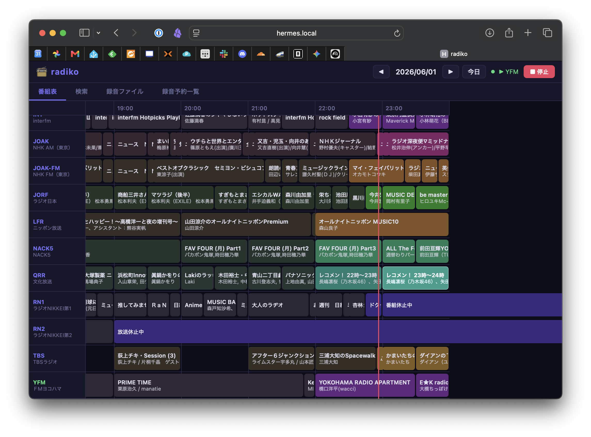
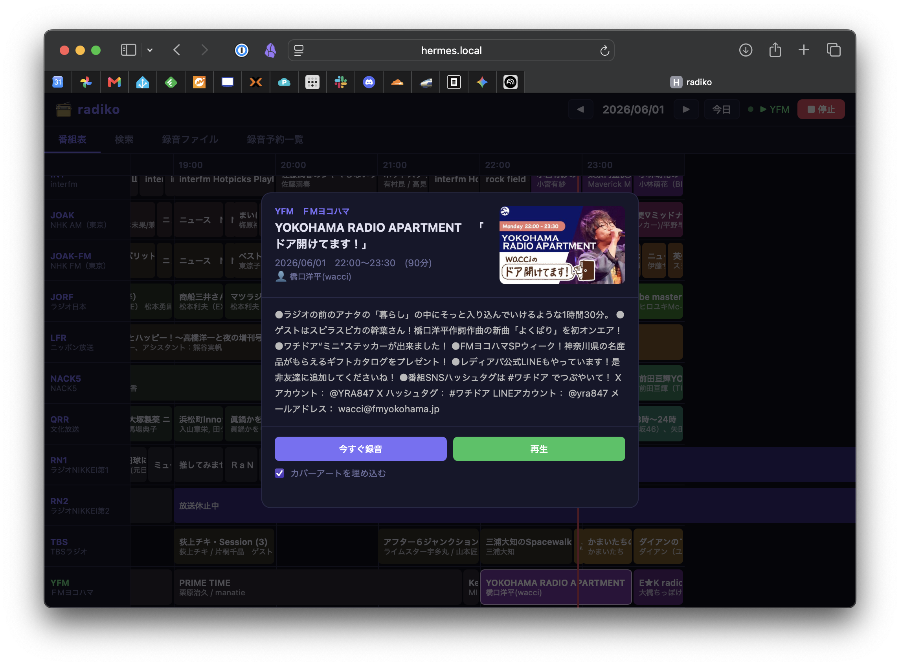
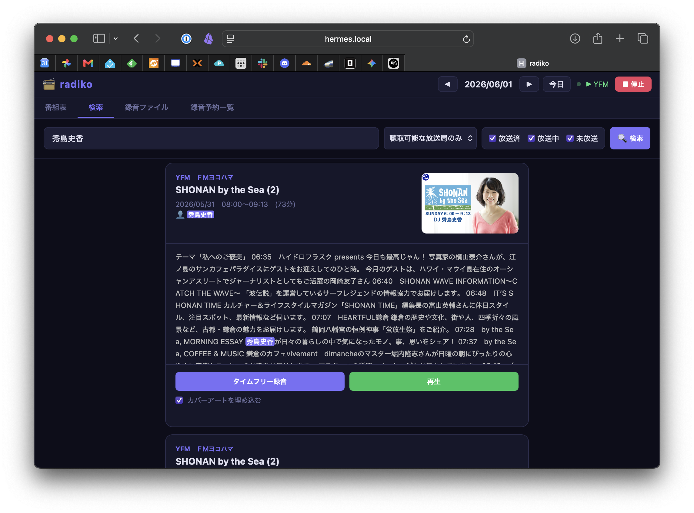

# radish

[radiko](http://radiko.jp/) / [NHKラジオ らじる★らじる](https://www.nhk.or.jp/radio/) / [ListenRadio](http://listenradio.jp/) で配信中・配信済みの番組を保存・再生するツール群です。配信形式と同じフォーマットで保存するため、別形式へのエンコードは行いません。

オリジナルのシェルスクリプト（[`radi.sh` / `radish-play.sh`](#原作のシェルスクリプトradish--radish-playsh)、作者: うる。 [@uru_2](https://twitter.com/uru_2)）をベースに、Python 製の CLI・録音エンジン・Web UI を追加したフォークです。原作は 2025-05-16 を最後に更新停止しています。


## スクリーンショット

### 番組表



- 聴取可能な放送局と番組を一覧できます
- 放送局をクリックするとその放送局が再生されます

### 番組情報



- 番組をクリックすると番組情報を確認できます
- 放送済もしくは放送中の番組はその場で再生できます
- 未放送の番組は録音を予約できます

### 検索



- 番組名・パーソナリティ・番組情報からキーワード検索できます
- 聴取可能な放送局のみ／全局、放送状態（放送済・放送中・未放送）で絞り込めます


## 構成

| ファイル | 役割 |
|:-|:-|
| `radiko_cli.py` | メイン CLI。番組表 DB の更新・検索、録音、スケジュール、再生制御、カバーアート埋め込み |
| `radiko_recorder.py` | 録音・再生エンジン。radiko 認証〜HLS URL 取得を標準ライブラリのみで実装し、取得は ffmpeg / ffplay に委譲。CLI / Web UI 両方から利用される |
| `radiko_programs.py` | radiko API から週間番組表を取得し DB スキーマ相当の dict を生成（urllib + ElementTree のみ） |
| `web_ui/web_ui.py` | FastAPI 製 REST API（ポート 8470） |
| `web_ui/static/index.html` | シングルページ Web UI（番組表・検索・録音・再生・予約管理） |
| `radi.sh` / `radish-play.sh` | 原作のシェルスクリプト（NHK / radiko / ListenRadio 対応） |

### データの流れ

```
radiko API ──→ radiko_programs.py ──→ radiko_cli.py update-programs ──→ radiko.db (SQLite)
                                                                          │ 参照
        radiko_cli.py (CLI)  ──┐                                          │
        web_ui.py (REST API) ──┴─→ radiko_recorder.py ────────────────────┴─→ ffmpeg / ffplay
                                   (認証・HLS URL 取得)
```


## 必要なもの

### 共通

- FFmpeg（3.x 以降、AAC / HLS サポート）— 録音・再生に使用
- Python 3

```
sudo apt install ffmpeg
```

### radiko_cli.py

```
pip install -r requirements.txt   # rich, rich-click
```

Raspberry Pi OS / Debian 系では apt でもインストールできます。
```
sudo apt install python3-rich python3-rich-click
```

`schedule-record` などの予約録音には `at` も必要です。

```
sudo apt install at
sudo systemctl enable --now atd
```

### web_ui/web_ui.py（Web UI）

```
pip install fastapi uvicorn
# 環境によっては: pip install --break-system-packages fastapi uvicorn
```

### radi.sh / radish-play.sh（原作スクリプト）

- curl
- libxml2-utils (xmllint)
- jq
- FFmpeg

```
sudo apt install curl libxml2-utils jq ffmpeg
```


## 使い方（radiko_cli.py）

### 初回セットアップ

番組表を取得して DB に格納します。

```
$ python radiko_cli.py update-programs   # 番組表＋放送局を更新
$ python radiko_cli.py auto-enable       # 受信可能な放送局を enabled_stations.txt に書き出す
```

### よく使うコマンド

```
$ python radiko_cli.py search 秀島史香             # 番組名・パーソナリティ・説明文から検索
$ python radiko_cli.py show-now                   # 現在放送中の番組を表示（受信可能局のみ）
$ python radiko_cli.py show-program 13392705      # 番組 ID で詳細表示
$ python radiko_cli.py record 13392705 --with-art # 録音（方法は自動判定、カバーアート埋め込み）
$ python radiko_cli.py play YFM                   # ライブ再生（バックグラウンド）
$ python radiko_cli.py stop                       # 再生停止
```

### コマンド一覧

| コマンド | 説明 |
|:-|:-|
| `update-programs` | radiko API から番組表・放送局を DB に更新 |
| `update-stations` | 放送局一覧のみ更新 |
| `list-stations` | DB に登録された放送局一覧を表示 |
| `auto-enable` | 受信可能な放送局を検出し `enabled_stations.txt` に書き出す |
| `show-now` | 現在放送中の番組を表示（`enabled_stations.txt` 準拠、なければ全局） |
| `show-program <prog_id>` | 番組 ID で詳細表示 |
| `search <keyword>` | 番組名・パーソナリティ・説明文を全文検索 |
| `record <prog_id>` | 録音。過去→タイムフリー、未来→`at` 予約、放送中→即時録音を自動判定 |
| `timefree-record` | タイムフリー録音（放送後 7 日以内） |
| `schedule-record` | `at` による予約録音を生成・登録 |
| `list-schedules` / `cancel-schedule` | `at` 予約の一覧・取り消し |
| `list-recordings` | ディレクトリ内の録音ファイル（*.m4a）を一覧表示（`--dir` で指定、既定はカレント） |
| `play` / `stop` / `now-playing` | ライブ再生・停止・再生中番組の表示 |
| `embed-art` | 録音ファイルに番組のカバーアートを埋め込む（局ID/日付/時刻はファイル名から自動判別） |
| `init-db` | DB（stations / programs）を初期化 |

ヘルプは各コマンドに `--help` を付けると表示されます。

> **タイムフリー録音推奨**: radiko のライブ配信はタイムラグが大きいため、過去番組のタイムフリー保存のほうが速く、ラグも小さくなります（原作者の知見）。`record` コマンドは放送終了後に自動でタイムフリーへ切り替わります。


## Web UI

```
$ python web_ui/web_ui.py
# → http://localhost:8470
```

ブラウザから以下が行えます。

- **番組表**: タイムテーブル形式で表示、放送局クリックでライブ再生、番組クリックで録音・再生
- **検索**: キーワード検索。聴取可能な放送局のみ／全局、放送状態（放送済・放送中・未放送）の絞り込みに対応
- **録音ファイル**: 一覧・ダウンロード・削除、録音中の状態表示
- **録音予約一覧**: `at` 予約の確認・取り消し

事前に `radiko_cli.py update-programs` で番組表を取得しておく必要があります。


## 原作のシェルスクリプト（radi.sh / radish-play.sh）

リアルタイム保存のための原作スクリプトです。NHK らじる★らじる・ListenRadio にも対応しています。

```
$ ./radi.sh [options]
```

| 引数 | 必須 | 説明 | 備考 |
|:-|:-:|:-|:-|
| `-t` _SITE TYPE_ | ○ | 録音対象サイト | `nhk`: NHK らじる★らじる<br>`radiko`: radiko<br>`lisradi`: ListenRadio |
| `-s` _STATION ID_ | △ | 放送局 ID | `-l` で表示される ID |
| `-d` _MINUTE_ | ○ | 録音時間（分） | |
| `-i` _MAIL_ | | ラジコプレミアム ログインメールアドレス | 環境変数 `RADIKO_MAIL` でも指定可 |
| `-p` _PASSWORD_ | | ラジコプレミアム ログインパスワード | 環境変数 `RADIKO_PASSWORD` でも指定可 |
| `-o` _PATH_ | | 出力パス | 未指定時はカレントに `放送局ID_年月日時分秒.m4a` を作成。拡張子は自動補完 |
| `-l` | | 放送局 ID / 名称表示 | 結果は 300 行以上、取得はやや重い |

### 実行例

```
# NHK らじる★らじる
$ ./radi.sh -t nhk -s tokyo-fm -d 31 -o "/hoge/foo.m4a"

# radiko エリア内の局
$ ./radi.sh -t radiko -s LFR -d 21 -o "/hoge/$(date "+%Y-%m-%d") テレフォン人生相談.m4a"

# radiko エリア外の局（ラジコプレミアム）
$ ./radi.sh -t radiko -s HBC -d 31 -o "/hoge/foo.m4a" -i "foo@example.com" -p "password"

# ラジコプレミアム（環境変数でログイン情報を指定）
$ export RADIKO_MAIL="foo@example.com"
$ export RADIKO_PASSWORD="password"
$ ./radi.sh -t radiko -s HBC -d 31 -o "/hoge/foo.m4a"

# ListenRadio
$ ./radi.sh -t lisradi -s 30058 -d 30 -o "/hoge/foo.m4a"
```


## 注意点

- 録音手法は対象サイトの仕様変更等で利用できなくなる可能性があります。
- radiko のタイムフリーは放送後 7 日以内が対象です。


## 作った人

- 原作（radi.sh / radish-play.sh）: うる。 ([@uru_2](https://twitter.com/uru_2))
- Python CLI・録音エンジン・Web UI の追加: フォーク版メンテナ


## ライセンス

[MIT License](LICENSE)
